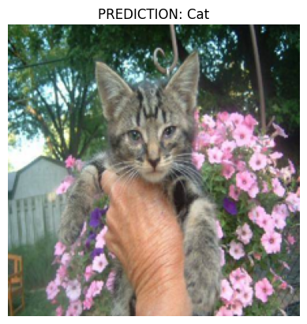
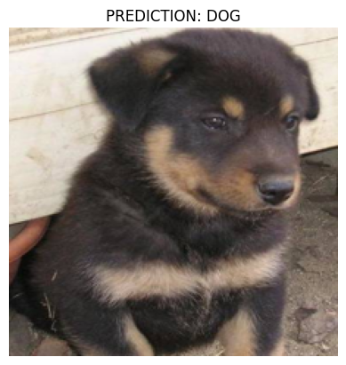

# 🐶🐱 Final AP Computer Science Principles Project  
### **By Michael Wu**

In this project, I develop a moderately deep Convolutional Neural Network (CNN) with Residual Units (~20 layers) to classify images of **dogs** and **cats**. The ultimate goal is to create an approach that will accurately classify images of dogs or cats fed into the ML model.

Although this is far beyond the scope of AP Computer Science Principles, I thought it would be a fun challenge to test my PyTorch ML Skills. This project is made to have ease of use and anybody with minimal programming experience should be able to run the notebook (`shift + enter` to run cells).

The code can work for Macbook `mps`, Nvidia `cuda`, and `cpu`. However, through testing and training on `50 epochs`, the `nvidia 3060` outperforms the `m3 pro`. 

📂 **Dataset**: [Dogs vs. Cats (Kaggle Competition)](https://www.kaggle.com/competitions/dogs-vs-cats/overview)

# Set Up Steps To Create a Conda Kernel To Isolate Installation Versions
```bash
conda create --name pytorch_ml python=3.11.2
conda activate pytorch_ml
conda install jupyter
python -m ipykernel install --user --name=pytorch_ml --display-name "PyTorch ML"
```

# Version Used
```bash
torch ==2.5.1
torchvision ==0.20.1
matplotlib ==3.10.1
numpy ==2.0.1
PIL ==11.1.0
tqdm ==4.67.1
```

You can clone the repository by specifying `git clone url of project`

# Example Predictions 
<div style="display: flex; justify-content: space-around;">
  
  
</div>


# Procedures 
The steps enumerated below are the main idea for training and testing:

`1. Load in Data/Visualize Data`

`2. Do data transformations/turn images into tensors for training`

`3. Create the Machine Learning Model `

`4. Train the model for n epochs`

`5. Evaluate the model`

`6. Save the trained weights`

`7. Predict! `


# Requirements Satisfied 
 ✅ A clear purpose: `This project classifies dogs and cats`
 
 ✅ An effective user interface: `Jupyter Notebook`
 
 ✅ Development and use of abstractions to manage the complexity of your program: `pytorch (pytorch has alot of abstractions)`
 
 ✅ Comments within the code to explain its functionality: `Alot of comments made`
 
 ✅ Effective use of numbers, variables, mathematical expressions with arithmetic operators, logical and
Boolean operators and expressions, conditional statements (selection), loops (iteration), and functions: `Used iteration, sequencing, selection, and alot of math that is abstraction (tensor manipulation, gradient, backdrop, etc)`
